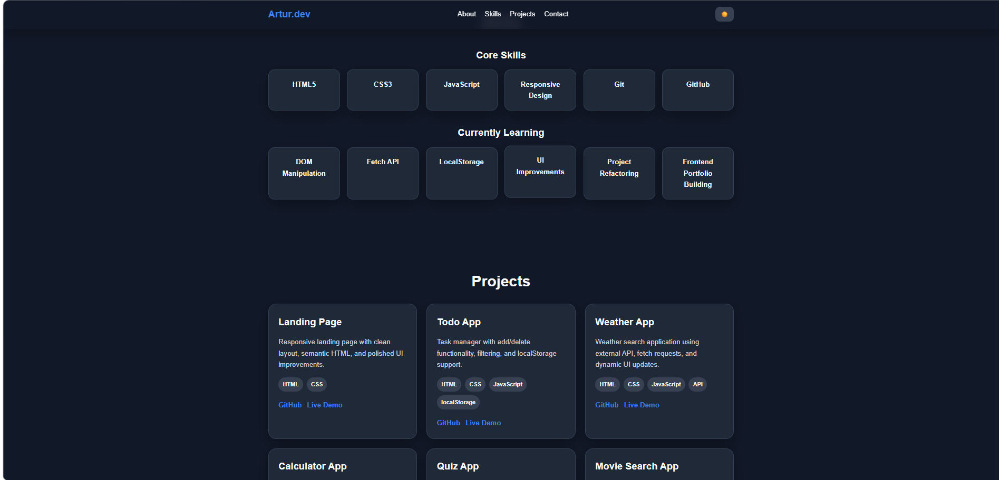

# Portfolio Website V2

Personal portfolio website built with HTML, CSS and JavaScript.

## Features

- Responsive layout
- Sticky header navigation
- Hero section with clear call-to-action
- About me section
- Skills and currently learning sections
- Project showcase with tech stack tags
- Contact section with external links
- Dark mode toggle
- Theme saved in localStorage
- Scroll reveal animations
- Smooth scrolling navigation

## Technologies

- HTML5
- CSS3
- JavaScript

## Project Goal

This project was created to present my frontend development skills, showcase my project, and provide a single place where recruiters and employers can quickly review my work and progress.

## Included Projects

- Landing Page
- ToDo App
- Weather App
- Calculator App
- Quizz App
- Movie Search App
- Portfolio Website

## Live Demo

[Open Portfolio](https://portfolio-website-archyteam.netlify.app)

## Screenshot

## Status

Portfolio Website V2 - improved structure, UI polish, better project presentation, and scroll animations.
